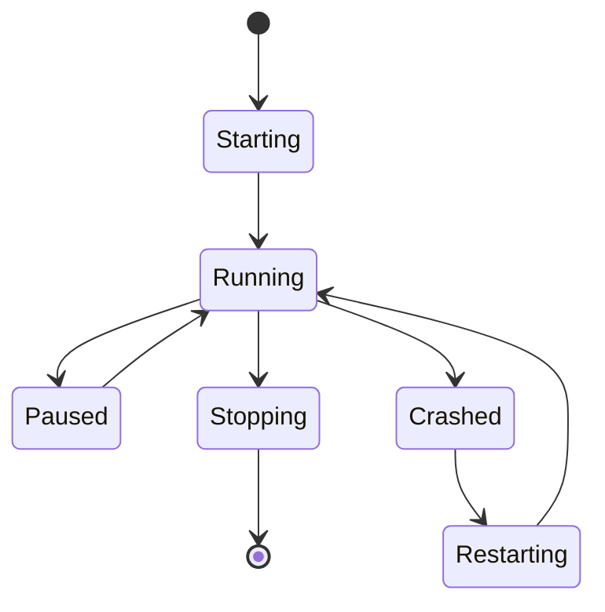

# 🏛️ AVIATOR - System Architecture

<div align="center">

**High-Performance Multi-Bookmaker Data Collection & Automation System**

[]()
[]()
[]()

</div>

---

## 📐 System Overview

AVIATOR koristi **multi-process parallel arhitekturu** sa **event-driven komunikacijom** za maksimalne performanse pri simultanom praćenju više kladionica.

### 🎯 **KLJUČNI PRINCIP: 1 BOOKMAKER = 1 PROCES**

```
6 Bookmaker-a = 6 Paralelnih Procesa = 6 CPU Cores

CPU Core 1: Process 1 (Bookmaker1) - OCR 100ms ┐
CPU Core 2: Process 2 (Bookmaker2) - OCR 100ms │ Sve paralelno
CPU Core 3: Process 3 (Bookmaker3) - OCR 100ms │ istovremeno
CPU Core 4: Process 4 (Bookmaker4) - OCR 100ms │ na različitim
CPU Core 5: Process 5 (Bookmaker5) - OCR 100ms │ CPU cores
CPU Core 6: Process 6 (Bookmaker6) - OCR 100ms ┘

UKUPNO VREME: 100ms (ne 600ms!)
```

**Razlog:** OCR čitanje (Tesseract) je CPU-intensive (100ms+). Sekvencijalno čitanje 6 bookmaker-a bi trajalo 600ms, što je neprihvatljivo za real-time tracking.

### 🎯 Architecture Goals

<table>
<tr>
<td width="25%">

**🚀 Performance**
- OCR < 15ms
- 1000 rounds/hour
- Batch operations

</td>
<td width="25%">

**🔐 Reliability**
- Auto-recovery
- Data validation
- Error handling

</td>
<td width="25%">

**📈 Scalability**
- 6+ bookmakers
- Parallel processing
- Shared resources

</td>
<td width="25%">

**🧩 Modularity**
- Loose coupling
- Event-driven
- Clean interfaces

</td>
</tr>
</table>

---

## 🗺️ High-Level Architecture

```
┌─────────────────────────────────────────────────────────┐
│                    MAIN PROCESS (GUI)                   │
│  - PySide6 GUI Control Panel                           │
│  - ProcessManager (spawns worker processes)            │
│  - EventBus Dispatcher (receives events from workers)  │
│  - SharedGameState (optional, for GUI monitoring)      │
└────────┬────────────────────────────────────────────────┘
         │
         │ Spawns 6 independent worker processes
         │ (1 process per bookmaker = TRUE PARALLELISM)
         │
    ┌────┴─────┬─────────┬─────────┬─────────┬─────────┐
    │          │         │         │         │         │
┌───▼────┐ ┌──▼─────┐ ┌─▼──────┐ ┌─▼──────┐ ┌─▼──────┐ ┌─▼──────┐
│WORKER 1│ │WORKER 2│ │WORKER 3│ │WORKER 4│ │WORKER 5│ │WORKER 6│
│PROCESS │ │PROCESS │ │PROCESS │ │PROCESS │ │PROCESS │ │PROCESS │
│Admiral │ │Mozzart │ │Balkan  │ │Soccer  │ │Meridian│ │MaxBet  │
└────────┘ └────────┘ └────────┘ └────────┘ └────────┘ └────────┘
    │          │         │         │         │         │
    ├─ OCR     ├─ OCR    ├─ OCR    ├─ OCR    ├─ OCR    ├─ OCR
    ├─ Coll    ├─ Coll   ├─ Coll   ├─ Coll   ├─ Coll   ├─ Coll
    └─ Agents  └─ Agents └─ Agents └─ Agents └─ Agents └─ Agents

    All processes write to:
    ├─ Database (batch writes via connection pool)
    ├─ EventBus (real-time events for GUI)
    └─ SharedGameState (optional, for GUI stats)
```

### **Ključne karakteristike:**

1. **Pravi paralelizam** - Svaki proces na svom CPU core-u
2. **Crash isolation** - Pad jednog procesa ne utiče na druge
3. **Independent memory** - Svaki proces ima svoj memory space
4. **Scalability** - Dodavanje bookmaker-a = dodavanje procesa

---

## 🔄 Core Patterns & Principles

### 1. 🔄 Worker Process Pattern - JEDAN BOOKMAKER = JEDAN PROCES

**Problem:** OCR je CPU-intensive (100ms+). Sekvencijalno čitanje je presporo.
**Solution:** Svaki bookmaker u zasebnom procesu sa svojim OCR reader-om.

```python
# ❌ WRONG - Sekvencijalno (OLD architecture)
SharedReader → FOR each bookmaker:  # SEQUENTIAL!
    Bookmaker1 OCR (100ms)
    Bookmaker2 OCR (100ms)
    Bookmaker3 OCR (100ms)
Total: 300ms

# ✅ CORRECT - Paralelno (NEW architecture)
Worker1 Process → Bookmaker1 OCR (100ms) ┐
Worker2 Process → Bookmaker2 OCR (100ms) │ Parallel
Worker3 Process → Bookmaker3 OCR (100ms) ┘ na CPU cores
Total: 100ms (not 300ms!)
```

**Implementation:**
```python
class BookmakerWorkerProcess:
    """
    Samostalan proces za JEDAN bookmaker.
    Sadrži SVE komponente za taj bookmaker:
    - OCR reading (CPU intensive - zato proces!)
    - Collectors (MainCollector, RGBCollector)
    - Agents (BettingAgent, SessionKeeper kao threads)
    - StrategyExecutor
    """

    def __init__(self, bookmaker_name, coords, config):
        self.bookmaker = bookmaker_name

        # OCR Reader (radi u ovom procesu)
        self.ocr_reader = MultiRegionReader(coords)

        # Local state (in-process, BRZO)
        self.local_state = {}
        self.round_history = deque(maxlen=100)

        # Collectors (rade u ovom procesu)
        self.main_collector = MainCollector(...)
        self.rgb_collector = RGBCollector(...)

        # Strategy
        self.strategy_executor = StrategyExecutor(...)

        # Agents (threads UNUTAR procesa)
        self.betting_agent = BettingAgent(...)
        self.session_keeper = SessionKeeper(...)

    def run(self):
        """Main OCR loop - radi u procesu"""
        while not shutdown:
            # 1. OCR READ (CPU intensive - paralelno sa drugim procesima!)
            state = self.ocr_reader.read_all_regions()

            # 2. Update LOCAL state (in-process, instant access)
            self.local_state = state

            # 3. Collectors koriste local_state
            if state.phase == GamePhase.ENDED:
                round_data = self.main_collector.collect(state)
                self.round_history.append(round_data)

            # 4. BettingAgent (thread) čita local_state
            # 5. SessionKeeper (thread) šalje fake clicks
```

**Zašto proces a ne thread?**
- **GIL bypass** - Python GIL ne blokira procese
- **Pravi paralelizam** - 6 CPU cores istovremeno rade OCR
- **Crash isolation** - Pad jednog ne ruši druge
- **Memory isolation** - Svaki ima svoj memory space

### 2. 📦 Batch Operations Pattern - SHARED WRITER PER TYPE

**Problem:** Single database inserts are slow
**Solution:** Buffer and batch write with shared writer per collector/agent TYPE

**KRITIČNO: JEDAN BatchWriter po TIPU, ne po bookmaker-u!**

```python
# ❌ POGREŠNO - Svaki Worker ima svoj writer
Worker1 (Admiral):  BatchWriter instance → 10 zapisa → flush
Worker2 (Mozzart):  BatchWriter instance → 10 zapisa → flush
Worker3 (BalkanBet): BatchWriter instance → 10 zapisa → flush
Total: 3 flushes, manje efikasno

# ✅ ISPRAVNO - Shared writer po tipu
MainCollector_Writer (shared):
  ├─ Worker1 (Admiral)  → add(record)  ┐
  ├─ Worker2 (Mozzart)  → add(record)  │ Buffer 50-100
  ├─ Worker3 (BalkanBet)→ add(record)  │ zapisa odjednom
  └─ Flush → Database (1x, efikasno)   ┘

BettingAgent_Writer (shared):
  ├─ Worker1 → add(bet)  ┐
  ├─ Worker2 → add(bet)  │ Buffer zapise
  └─ Flush → Database    ┘
```

**Implementacija:**
```python
# U main.py ili ProcessManager
# Kreiraj SHARED writers
main_collector_writer = BatchDatabaseWriter(
    db_path="data/main_game.db",
    table_name="rounds",
    batch_size=100
)

betting_writer = BatchDatabaseWriter(
    db_path="data/betting_history.db",
    table_name="bets",
    batch_size=50
)

# Prosleđuj ISTI writer svim Workers-ima
for bookmaker in bookmakers:
    worker = BookmakerWorkerProcess(
        bookmaker=bookmaker,
        main_collector_writer=main_collector_writer,  # Shared!
        betting_writer=betting_writer  # Shared!
    )
```

**Zašto shared?**
- **50-100x brže** - Batch flush sa više zapisa odjednom
- **Manje I/O** - Jedan flush umesto N flushova
- **Thread-safe** - BatchWriter interno koristi lock
- **SQLite WAL mode** - Dozvoljava konkurentne operacije


### 3. 🔒 Atomic Transaction Pattern

**Problem:** Betting operations must be all-or-nothing  
**Solution:** Transaction controller with locks

```python
class TransactionController:
    def place_bet(self, amount, auto_stop):
        with self.lock:  # Acquire lock
            try:
                self.click_amount_field()
                self.type_amount(amount)
                self.click_autostop_field()
                self.type_autostop(auto_stop)
                self.click_play_button()
                return True  # All succeeded
            except:
                self.rollback()  # Undo all
                return False
            finally:
                self.lock.release()  # Release lock
```

### 4. 📡 Event-Driven Communication

**Problem:** Direct coupling between components
**Solution:** Pub/Sub via Event Bus

```python
# Worker process publishes event
event_bus.publish(Event(
    type=EventType.ROUND_END,
    data={'bookmaker': 'Admiral', 'score': 3.45}
))

# GUI subscribes and updates
@event_bus.subscribe(EventType.ROUND_END)
def on_round_end(event):
    self.log_widget.append(f"Round ended: {event.data['score']}")
    self.trigger_stats_refresh()
```

**EventBus uloga:**
- **Real-time GUI updates** - Instant event notifications
- **Logging** - Centralni log sistem
- **Monitoring** - Health checks i alerting
- **Loose coupling** - Workers ne znaju za GUI

### 5. 💾 SharedGameState vs Local State

**Problem:** Kako deliti podatke između procesa i GUI-ja?
**Solution:** Kombinacija local state (brzo) i SharedGameState (GUI monitoring)

```python
# 🔹 LOCAL STATE (unutar Worker procesa - BRZO)
class BookmakerWorkerProcess:
    def __init__(self):
        # Local state - samo ovaj proces ga vidi
        self.local_state = {}  # In-process dict - INSTANT access
        self.round_history = deque(maxlen=100)  # Za strategiju

    def run(self):
        # OCR čita i upisuje u LOCAL state
        self.local_state = self.ocr_reader.read()

        # Collectors INTERNO koriste local_state
        self.main_collector.collect(self.local_state)

        # BettingAgent čita LOCAL state (closure)
        self.betting_agent.get_state = lambda: self.local_state

# 🔹 SHARED GAME STATE (za GUI monitoring - Opciono)
# Worker opciono piše statistiku u SharedGameState
shared_game_state.set('Admiral_stats', {
    'total_rounds': 1245,
    'profit': 250.0,
    'current_phase': 'BETTING'
})

# GUI čita iz SharedGameState
stats = shared_game_state.get('Admiral_stats')
self.lbl_profit.setText(f"${stats['profit']}")
```

**Ključna razlika:**
- **local_state** = Glavni state unutar procesa (brzi pristup)
- **SharedGameState** = Kopija statistike za GUI (optional, sporiji)

**Zašto oba?**
- Workers rade sa `local_state` (bez overhead-a)
- GUI vidi statistiku preko `SharedGameState`
- Best of both worlds!

---

## 🏗️ Component Architecture

### 📁 Layer Structure

```
┌─────────────────────────────────────┐
│         PRESENTATION LAYER          │
│  • GUI Control Panel                │
│  • Configuration Manager            │
│  • Statistics Dashboard             │
└─────────────────────────────────────┘
                  │
┌─────────────────────────────────────┐
│        ORCHESTRATION LAYER          │
│  • Process Manager                  │
│  • Coordinator                      │
│  • Health Monitor                   │
└─────────────────────────────────────┘
                  │
┌─────────────────────────────────────┐
│         BUSINESS LAYER              │
│  • Collectors (Main, RGB)           │
│  • Agents (Betting, Session)        │
│  • Strategies                       │
└─────────────────────────────────────┘
                  │
┌─────────────────────────────────────┐
│           CORE LAYER                │
│  • OCR Engine                       │
│  • Screen Capture                   │
│  • Transaction Controller           │
│  • Event Bus                        │
└─────────────────────────────────────┘
                  │
┌─────────────────────────────────────┐
│           DATA LAYER                │
│  • Batch Writer                     │
│  • Connection Pool                  │
│  • Models & Schemas                 │
│  • Cache (Future)                   │
└─────────────────────────────────────┘
```

### 🔧 Component Details

#### Core Components

<table>
<tr>
<th>Component</th>
<th>Purpose</th>
<th>Key Features</th>
<th>Performance</th>
</tr>
<tr>
<td><b>OCR Engine</b></td>
<td>Text extraction</td>
<td>
• Multi-strategy<br>
• Template matching<br>
• Tesseract fallback
</td>
<td>10-15ms</td>
</tr>
<tr>
<td><b>Worker Process</b></td>
<td>Bookmaker worker</td>
<td>
• Own OCR reader<br>
• Local state<br>
• Parallel execution
</td>
<td>10 reads/sec each</td>
</tr>
<tr>
<td><b>Event Bus</b></td>
<td>Communication</td>
<td>
• Pub/Sub pattern<br>
• Priority queue<br>
• Rate limiting
</td>
<td>1000+ events/sec</td>
</tr>
<tr>
<td><b>Batch Writer</b></td>
<td>Database writes</td>
<td>
• Buffer management<br>
• Auto-flush<br>
• Connection pool
</td>
<td>5000+ records/sec</td>
</tr>
</table>

#### Agents Layer - Automation Components

**KRITIČNO: BettingAgent i SessionKeeper NIKAD ne rade istovremeno za isti bookmaker!**

<table>
<tr>
<th>Agent</th>
<th>Uloga</th>
<th>Runtime</th>
<th>Ključne funkcije</th>
</tr>
<tr>
<td><b>BettingAgent</b></td>
<td>Betting execution</td>
<td>Thread u Worker procesu</td>
<td>
• Čuva round_history (deque 100)<br>
• Poziva StrategyExecutor<br>
• Izvršava preko TransactionController<br>
• Kad je AKTIVAN → SessionKeeper PAUSED
</td>
</tr>
<tr>
<td><b>SessionKeeper</b></td>
<td>Session maintenance</td>
<td>Thread u Worker procesu</td>
<td>
• Simulira aktivnost (fake clicks)<br>
• Interval: 250-350s (random)<br>
• Prvi klik nakon 300s + offset (30s * bookmaker_index)<br>
• Kad je AKTIVAN → BettingAgent NE radi
</td>
</tr>
<tr>
<td><b>StrategyExecutor</b></td>
<td>Strategy decisions</td>
<td>Objekat (poziva BettingAgent)</td>
<td>
• Input: round_history (100 rundi)<br>
• Output: [bet_amounts], [auto_stops]<br>
• Stateless - čista funkcija<br>
• Svaki bookmaker ima svoj instance
</td>
</tr>
</table>

**Data Flow - Betting & Strategy:**

```python
# BettingAgent čuva history i koordinira
class BettingAgent:
    def __init__(self):
        self.round_history = deque(maxlen=100)  # U memoriji!
        self.strategy_executor = StrategyExecutor()

    def on_round_end(self, round_data):
        # 1. Dodaj u history
        self.round_history.append(round_data)

        # 2. Pitaj strategiju šta da radi
        decision = self.strategy_executor.decide(
            history=list(self.round_history)
        )
        # decision = {
        #     'bet_amounts': [10, 20, 40, 70, 120, 200],
        #     'auto_stops': [2.20, 2.20, 2.20, 2.50, 3.00, 3.00],
        #     'current_index': 0
        # }

        # 3. Izvršava strategiju
        self.transaction_controller.place_bet(
            amount=decision['bet_amounts'][decision['current_index']],
            auto_stop=decision['auto_stops'][decision['current_index']]
        )
```

**PhaseCollector vs RGBCollector - Razlika:**

<table>
<tr>
<th>Aspekt</th>
<th>PhaseCollector</th>
<th>RGBCollector</th>
</tr>
<tr>
<td><b>Svrha</b></td>
<td>Prati logičke promene faza</td>
<td>Skuplja ML training data</td>
</tr>
<tr>
<td><b>Input</b></td>
<td>SharedGameState (OCR results)</td>
<td>Direct screen capture (raw pixels)</td>
</tr>
<tr>
<td><b>Output</b></td>
<td>Phase transitions (BETTING→PLAYING→ENDED)</td>
<td>RGB statistics (mean, std za R,G,B)</td>
</tr>
<tr>
<td><b>Frekvencija</b></td>
<td>Na phase promenu (retko)</td>
<td>2 Hz (svake 0.5s)</td>
</tr>
<tr>
<td><b>Use case</b></td>
<td>Game flow analiza, pattern detection</td>
<td>ML model treniranje (K-means clustering)</td>
</tr>
</table>

**Oba su potrebna jer služe različitim svrhama!**

---

## 🔄 Data Flow Architecture

### 1. Collection Pipeline

```
Screen → Capture → OCR → Validation → Shared Memory
                                            ↓
                    Collectors ← ← ← ← ← ← ┘
                         ↓
                    Event Bus
                         ↓
                    Batch Writer
                         ↓
                    Database
```

### 2. Betting Pipeline

```
Strategy → Decision → Transaction Controller
                            ↓
                      [LOCK ACQUIRED]
                            ↓
                    GUI Operations (Atomic)
                            ↓
                      [LOCK RELEASED]
                            ↓
                        Success/Fail
```

### 3. Event Flow

```
Worker Process → Event → EventBus → Queue → Dispatcher → Subscribers
                            ↑                               ↓
                            └──────── Feedback ────────────┘
```

---

## 📊 Performance Architecture

### OCR Optimization Strategy

```python
# Decision tree for OCR method selection
if score < 10:
    use_template_matching()  # 10ms
elif score < 100:
    use_hybrid_approach()    # 15ms
else:
    use_tesseract()          # 100ms
```

### Memory Management

```
Total Memory Budget: 600MB

├── Shared Memory: 100MB
│   ├── Game States: 50MB
│   └── Event Queue: 50MB
│
├── Process Memory: 400MB
│   ├── Worker 1-6: 50MB each
│   └── Manager: 100MB
│
└── Buffer Memory: 100MB
    ├── Batch Writer: 50MB
    └── Event Bus: 50MB
```

### CPU Utilization

```
Target: < 40% average

├── OCR Processing: 10%
├── Event Processing: 5%
├── Database Operations: 5%
├── GUI Rendering: 5%
├── Worker Processes: 10%
└── Idle/Overhead: 5%
```

---

## 🔐 Security & Safety Architecture

### Transaction Safety

```python
class TransactionSafety:
    # 1. Lock mechanism
    transaction_lock = threading.RLock()
    
    # 2. Atomic operations
    all_or_nothing = True
    
    # 3. Rollback capability
    rollback_on_error = True
    
    # 4. Audit logging
    log_all_transactions = True
```

### Data Integrity

```
Input → Validation → Processing → Verification → Storage
         ↓                          ↓
      [Reject]                  [Retry/Alert]
```

### Process Isolation

- Each worker in separate process
- Crash isolation
- Resource limits
- Health monitoring

---

## 🚀 Scalability Architecture

### Horizontal Scaling

```
Current: 6 bookmakers
├── Layout 4: 2x2 grid
├── Layout 6: 3x2 grid
└── Layout 8: 4x2 grid (future)

Scaling Strategy:
• Add more workers (up to CPU cores)
• Shared Reader reduces load
• Event Bus handles distribution
```

### Vertical Scaling

| Resource | Impact | Recommendation |
|----------|--------|----------------|
| **CPU Cores** | More workers | 8+ cores for 6 bookmakers |
| **RAM** | Larger buffers | 16GB for smooth operation |
| **SSD** | Faster I/O | NVMe for best performance |
| **Network** | Minimal impact | Any stable connection |

---

## 🏃 Runtime Architecture

### Process Hierarchy

```
Main Process (GUI)
    ├── Process Manager
    │   ├── Shared Reader Process
    │   ├── Health Monitor Process
    │   └── Worker Processes (1-6)
    │       ├── Main Collector
    │       ├── RGB Collector
    │       └── Betting Agent
    │
    ├── Event Bus Thread
    └── Batch Writer Thread
```

### Lifecycle Management



---

## 🔗 Module Connection Tree

### Complete Import Chain from main.py

This tree shows how all modules are connected through imports, starting from the main entry point:

```python
main.py (Entry Point)
│
├── gui/ (6 files total, all connected)
│   ├── config_manager.py
│   │   └── imports: config.settings.PATH
│   │
│   ├── app_controller.py ⭐ (Critical Hub)
│   │   ├── imports: config.settings.PATH
│   │   ├── imports: orchestration.process_manager.ProcessManager
│   │   ├── imports: orchestration.bookmaker_worker.worker_entry_point
│   │   ├── imports: core.communication.event_bus.EventBus
│   │   └── imports: data.database.batch_writer.BatchDatabaseWriter
│   │
│   ├── setup_dialog.py
│   │   ├── imports: core.capture.region_manager.RegionManager
│   │   └── imports: config.settings
│   │
│   ├── stats_widgets.py
│   │   ├── imports: config.settings
│   │   └── imports: utils.logger
│   │
│   ├── tools_tab.py
│   │   ├── imports: core.capture.region_manager.RegionManager
│   │   ├── imports: config.settings.PATH
│   │   └── calls: utils.region_editor, utils.region_visualizer, utils.diagnostic
│   │
│   └── settings_tab.py
│       ├── imports: core.capture.region_manager.RegionManager
│       └── imports: config.settings
│
├── orchestration/ (4 files total, all connected)
│   ├── process_manager.py
│   │   └── imports: multiprocessing, threading, queue
│   │
│   ├── bookmaker_worker.py ⭐⭐ (Most Critical File)
│   │   ├── imports: config.settings (PATH, GamePhase, OCR)
│   │   ├── imports: core.ocr.engine.OCREngine
│   │   ├── imports: core.capture.screen_capture.ScreenCapture
│   │   ├── imports: core.communication.shared_state.SharedGameState
│   │   ├── imports: core.communication.event_bus.EventPublisher
│   │   ├── imports: collectors.main_collector.MainDataCollector
│   │   ├── imports: collectors.rgb_collector.RGBCollector
│   │   ├── imports: collectors.phase_collector.PhaseCollector
│   │   ├── imports: agents.betting_agent.BettingAgent
│   │   ├── imports: agents.session_keeper.SessionKeeper
│   │   └── imports: agents.strategy_executor.StrategyExecutor
│   │
│   ├── health_monitor.py (via orchestration.__init__)
│   └── coordinator.py (via orchestration.__init__)
│
├── core/ (11 active files)
│   ├── communication/
│   │   ├── event_bus.py
│   │   ├── shared_state.py
│   │   │   └── imports: config.settings.GamePhase
│   │   └── stats_queue.py  # Real-time worker→GUI communication
│   │       └── Queue system for live stats updates
│   │
│   ├── capture/
│   │   ├── region_manager.py
│   │   │   └── imports: config.settings
│   │   └── screen_capture.py
│   │
│   ├── ocr/
│   │   ├── engine.py
│   │   │   ├── imports: config.settings.OCRMethod, OCR
│   │   │   ├── imports: core.ocr.tesseract_ocr.TesseractOCR
│   │   │   ├── imports: core.ocr.template_ocr.TemplateOCR
│   │   │   └── imports: core.ocr.cnn_ocr.CNNOCRReader
│   │   ├── tesseract_ocr.py
│   │   ├── template_ocr.py
│   │   └── cnn_ocr.py
│   │
│   └── input/
│       ├── transaction_controller.py
│       └── action_queue.py
│
├── data/ (9 active files, 1 orphaned)  # Renamed from data_layer
│   ├── database/
│   │   ├── batch_writer.py
│   │   │   └── imports: data.database.query_builder
│   │   ├── connection.py (via data.__init__)
│   │   └── query_builder.py (via data.__init__)
│   │
│   ├── models/
│   │   ├── base.py
│   │   ├── round.py
│   │   │   └── imports: data.models.base
│   │   └── threshold.py
│   │       └── imports: data.models.base
│   │
│   ├── readers/  # NEW - Database readers
│   │   └── centralized_stats_reader.py
│   │       └── Centralized database reader with caching
│   │
│   └── cache/
│       └── redis_cache.py ❌ (ORPHANED - placeholder for future)
│
├── collectors/ (4 files total, all connected via bookmaker_worker)
│   ├── base_collector.py
│   │   ├── imports: core.communication.shared_state
│   │   └── imports: core.communication.event_bus
│   │
│   ├── main_collector.py
│   │   └── imports: collectors.base_collector.BaseCollector
│   │
│   ├── rgb_collector.py
│   │   ├── imports: collectors.base_collector.BaseCollector
│   │   └── imports: core.capture.screen_capture
│   │
│   └── phase_collector.py
│       └── imports: collectors.base_collector.BaseCollector
│
├── agents/ (3 files total, all connected via bookmaker_worker)
│   ├── betting_agent.py
│   │   ├── imports: agents.strategy_executor.StrategyExecutor
│   │   ├── imports: strategies.base_strategy
│   │   └── imports: core.input.transaction_controller
│   │
│   ├── session_keeper.py
│   │   └── imports: core.input.transaction_controller
│   │
│   └── strategy_executor.py
│
├── strategies/ (2 active files)
│   ├── base_strategy.py
│   └── martingale.py
│       └── imports: strategies.base_strategy
│
├── utils/ (6 active files, all connected)
│   ├── logger.py (imported by main.py)
│   ├── log_reader.py  # Log file reader thread
│   ├── region_editor.py (called from tools_tab)
│   ├── region_visualizer.py (called from tools_tab)
│   ├── diagnostic.py (called from tools_tab)
│   ├── quick_test.py (called from tools_tab)
│   └── template_generator.py (standalone tool)
│
├── tests/ (4 files, connected via imports)
│   ├── ocr_performance.py
│   │   └── imports: core.ocr.engine, config.settings
│   ├── ocr_accuracy.py
│   │   └── imports: core.ocr.engine, config.settings
│   ├── ml_phase_performance.py
│   │   └── imports: core.capture.screen_capture, config.settings
│   └── ml_phase_accuracy.py
│       └── imports: core.capture.screen_capture, config.settings
│
├── storage/ (6 subdirectories)  # Renamed from data - actual file storage
│   ├── databases/  # SQLite database files
│   ├── models/     # ML model files (.pkl, .h5)
│   ├── screenshots/  # Saved screenshots for training
│   ├── ocr_templates/  # Template matching images
│   ├── knowledge/  # Knowledge base files
│   └── history/    # Historical documentation
│
└── config/
    └── settings.py (imported by almost everything)
        └── defines: PATH, OCR, COLLECT, BETTING, GamePhase, BetState, OCRMethod
```

### Critical Connection Points

1. **main.py** → **app_controller.py** → **bookmaker_worker.py**
   - This is the primary execution chain
   - app_controller spawns worker processes
   - Each worker contains ALL collectors and agents

2. **bookmaker_worker.py** - The Hub
   - Imports from 6 different modules
   - Creates instances of all collectors and agents
   - Coordinates all real-time operations

3. **config.settings** - Universal Configuration
   - Imported by 25+ files
   - Central configuration for entire system
   - PATH constants used everywhere

4. **batch_writer.py** - Shared Resource
   - Created in app_controller
   - Shared among all workers
   - Critical for database operations

### Orphaned Files (Not Connected)

- **data/cache/redis_cache.py** - Placeholder for future Redis implementation

### Connection Statistics

| Category | Connected | Orphaned | Total |
|----------|-----------|----------|-------|
| GUI | 6 | 0 | 6 |
| Core | 11 | 0 | 11 |
| Orchestration | 4 | 0 | 4 |
| Data | 9 | 1 | 10 |
| Collectors | 4 | 0 | 4 |
| Agents | 3 | 0 | 3 |
| Strategies | 2 | 0 | 2 |
| Utils | 7 | 0 | 7 |
| Tests | 4 | 0 | 4 |
| Config | 1 | 0 | 1 |
| Storage | N/A | N/A | N/A |
| **TOTAL** | **51** | **1** | **52** |
| **Package __init__ files** | 16 | 0 | 16 |
| **GRAND TOTAL** | **67** | **1** | **68** |

**Connection Rate: 98.5%** (67 of 68 files connected)

---

## 🔮 Future Architecture Plans

### Phase 1 - Current (Completed ✅)
- Local deployment
- SQLite database
- GUI control
- Basic ML models

### Phase 2 - Enhanced (In Progress 🔄)
- Advanced ML predictions
- Redis caching layer
- REST API for remote control
- Performance optimizations

### Phase 3 - Distributed (Planned 📅)
- Cloud deployment ready
- PostgreSQL support
- Microservices architecture
- Mobile applications
- WebSocket streaming

### Phase 4 - Enterprise (Future 🚀)
- Kubernetes orchestration
- Multi-region support
- Real-time analytics
- API marketplace

---

## 📈 Monitoring & Observability

### Metrics Collection

```python
metrics = {
    # Performance
    'ocr_speed_ms': histogram,
    'rounds_per_hour': counter,
    'batch_write_speed': gauge,
    
    # Reliability
    'error_rate': rate,
    'uptime_seconds': counter,
    'crashes_total': counter,
    
    # Business
    'thresholds_crossed': counter,
    'data_accuracy': gauge,
    'profit_loss': gauge
}
```

### Health Checks

```
Every 10 seconds:
├── Process alive check
├── Memory usage check
├── CPU usage check
├── Queue depth check
└── Database connection check
```

---

## 🎯 Architecture Best Practices

### DO ✅
- Use shared reader for OCR
- Batch all database operations
- Communicate via Event Bus
- Handle errors gracefully
- Monitor resource usage
- Document interfaces

### DON'T ❌
- Duplicate OCR operations
- Use single inserts
- Create tight coupling
- Ignore error cases
- Skip monitoring
- Hardcode values

---

## 📚 Architecture Decisions Record (ADR)

| Decision | Rationale | Trade-off |
|----------|-----------|-----------|
| **Shared Reader** | Reduces CPU by 3x | Added complexity |
| **Batch Writing** | 50x faster writes | Delayed persistence |
| **Event Bus** | Loose coupling | Async complexity |
| **Multiprocessing** | True parallelism | Memory overhead |
| **SQLite** | Simple, fast, local | No remote access |

---

<div align="center">

**Architecture Version 2.0** | **Last Updated: 2024-12-20**

Built for **Performance** 🚀 **Reliability** 🔐 **Scalability** 📈

</div>