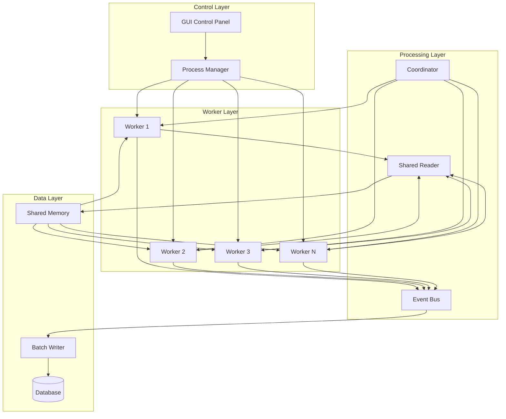
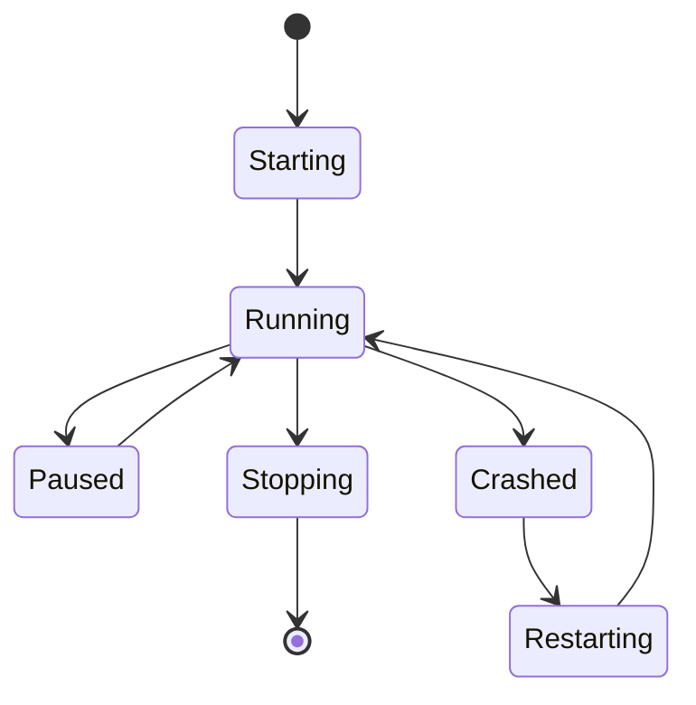

# 🏛️ AVIATOR - System Architecture

<div align="center">

**High-Performance Multi-Bookmaker Data Collection & Automation System**

[]()
[]()
[]()

</div>

---

## 📐 System Overview

AVIATOR koristi **event-driven microservice arhitekturu** sa **shared memory pattern-om** za maksimalne performanse pri simultanom praćenju više kladionica.

### 🎯 Architecture Goals

<table>
<tr>
<td width="25%">

**🚀 Performance**
- OCR < 15ms
- 1000 rounds/hour
- Batch operations

</td>
<td width="25%">

**🔐 Reliability**
- Auto-recovery
- Data validation
- Error handling

</td>
<td width="25%">

**📈 Scalability**
- 6+ bookmakers
- Parallel processing
- Shared resources

</td>
<td width="25%">

**🧩 Modularity**
- Loose coupling
- Event-driven
- Clean interfaces

</td>
</tr>
</table>

---

## 🗺️ High-Level Architecture



---

## 🔄 Core Patterns & Principles

### 1. 📖 Shared Reader Pattern

**Problem:** Multiple procesi trebaju OCR podatke  
**Solution:** Jedan reader, shared memory za sve

```python
# Traditional (BAD) - Every process reads
Process1 → OCR → Data1  # 100ms
Process2 → OCR → Data2  # 100ms
Process3 → OCR → Data3  # 100ms
Total: 300ms, 3x CPU usage

# Shared Reader (GOOD) - One reads, all use
SharedReader → OCR → SharedMemory  # 100ms
                         ├→ Process1
                         ├→ Process2
                         └→ Process3
Total: 100ms, 1x CPU usage
```

**Implementation:**
```python
class SharedGameStateReader:
    def __init__(self):
        self.shared_memory = Manager().dict()
        
    def read_cycle(self):
        # Read once
        data = self.ocr_engine.read()
        # Share with all
        self.shared_memory['state'] = data
        
    def get_state(self, bookmaker):
        # Instant access, no OCR
        return self.shared_memory.get(bookmaker)
```

### 2. 📦 Batch Operations Pattern

**Problem:** Single database inserts are slow  
**Solution:** Buffer and batch write

```python
# Traditional (SLOW) - 1ms per insert
for record in records:  # 1000 records
    db.insert(record)   # Total: 1000ms

# Batch (FAST) - 10ms for all
buffer.extend(records)  # 1000 records
if len(buffer) >= 50:
    db.insert_many(buffer)  # Total: 10ms
```

**Performance Gain: 50-100x faster**

### 3. 🔒 Atomic Transaction Pattern

**Problem:** Betting operations must be all-or-nothing  
**Solution:** Transaction controller with locks

```python
class TransactionController:
    def place_bet(self, amount, auto_stop):
        with self.lock:  # Acquire lock
            try:
                self.click_amount_field()
                self.type_amount(amount)
                self.click_autostop_field()
                self.type_autostop(auto_stop)
                self.click_play_button()
                return True  # All succeeded
            except:
                self.rollback()  # Undo all
                return False
            finally:
                self.lock.release()  # Release lock
```

### 4. 📡 Event-Driven Communication

**Problem:** Direct coupling between components  
**Solution:** Pub/Sub via Event Bus

```python
# Publisher
event_bus.publish(Event(
    type=EventType.ROUND_END,
    data={'score': 3.45}
))

# Subscribers
@event_bus.subscribe(EventType.ROUND_END)
def on_round_end(event):
    process_round(event.data)
```

---

## 🏗️ Component Architecture

### 📁 Layer Structure

```
┌─────────────────────────────────────┐
│         PRESENTATION LAYER          │
│  • GUI Control Panel                │
│  • Configuration Manager            │
│  • Statistics Dashboard             │
└─────────────────────────────────────┘
                  │
┌─────────────────────────────────────┐
│        ORCHESTRATION LAYER          │
│  • Process Manager                  │
│  • Coordinator                      │
│  • Health Monitor                   │
└─────────────────────────────────────┘
                  │
┌─────────────────────────────────────┐
│         BUSINESS LAYER              │
│  • Collectors (Main, RGB)           │
│  • Agents (Betting, Session)        │
│  • Strategies                       │
└─────────────────────────────────────┘
                  │
┌─────────────────────────────────────┐
│           CORE LAYER                │
│  • OCR Engine                       │
│  • Screen Capture                   │
│  • Transaction Controller           │
│  • Event Bus                        │
└─────────────────────────────────────┘
                  │
┌─────────────────────────────────────┐
│           DATA LAYER                │
│  • Batch Writer                     │
│  • Connection Pool                  │
│  • Models & Schemas                 │
│  • Cache (Future)                   │
└─────────────────────────────────────┘
```

### 🔧 Component Details

#### Core Components

<table>
<tr>
<th>Component</th>
<th>Purpose</th>
<th>Key Features</th>
<th>Performance</th>
</tr>
<tr>
<td><b>OCR Engine</b></td>
<td>Text extraction</td>
<td>
• Multi-strategy<br>
• Template matching<br>
• Tesseract fallback
</td>
<td>10-15ms</td>
</tr>
<tr>
<td><b>Shared Reader</b></td>
<td>Centralized OCR</td>
<td>
• One reader for all<br>
• Shared memory<br>
• Smart intervals
</td>
<td>10 reads/sec</td>
</tr>
<tr>
<td><b>Event Bus</b></td>
<td>Communication</td>
<td>
• Pub/Sub pattern<br>
• Priority queue<br>
• Rate limiting
</td>
<td>1000+ events/sec</td>
</tr>
<tr>
<td><b>Batch Writer</b></td>
<td>Database writes</td>
<td>
• Buffer management<br>
• Auto-flush<br>
• Connection pool
</td>
<td>5000+ records/sec</td>
</tr>
</table>

---

## 🔄 Data Flow Architecture

### 1. Collection Pipeline

```
Screen → Capture → OCR → Validation → Shared Memory
                                            ↓
                    Collectors ← ← ← ← ← ← ┘
                         ↓
                    Event Bus
                         ↓
                    Batch Writer
                         ↓
                    Database
```

### 2. Betting Pipeline

```
Strategy → Decision → Transaction Controller
                            ↓
                      [LOCK ACQUIRED]
                            ↓
                    GUI Operations (Atomic)
                            ↓
                      [LOCK RELEASED]
                            ↓
                        Success/Fail
```

### 3. Event Flow

```
Worker Process → Event → EventBus → Queue → Dispatcher → Subscribers
                            ↑                               ↓
                            └──────── Feedback ────────────┘
```

---

## 📊 Performance Architecture

### OCR Optimization Strategy

```python
# Decision tree for OCR method selection
if score < 10:
    use_template_matching()  # 10ms
elif score < 100:
    use_hybrid_approach()    # 15ms
else:
    use_tesseract()          # 100ms
```

### Memory Management

```
Total Memory Budget: 600MB

├── Shared Memory: 100MB
│   ├── Game States: 50MB
│   └── Event Queue: 50MB
│
├── Process Memory: 400MB
│   ├── Worker 1-6: 50MB each
│   └── Manager: 100MB
│
└── Buffer Memory: 100MB
    ├── Batch Writer: 50MB
    └── Event Bus: 50MB
```

### CPU Utilization

```
Target: < 40% average

├── OCR Processing: 10%
├── Event Processing: 5%
├── Database Operations: 5%
├── GUI Rendering: 5%
├── Worker Processes: 10%
└── Idle/Overhead: 5%
```

---

## 🔐 Security & Safety Architecture

### Transaction Safety

```python
class TransactionSafety:
    # 1. Lock mechanism
    transaction_lock = threading.RLock()
    
    # 2. Atomic operations
    all_or_nothing = True
    
    # 3. Rollback capability
    rollback_on_error = True
    
    # 4. Audit logging
    log_all_transactions = True
```

### Data Integrity

```
Input → Validation → Processing → Verification → Storage
         ↓                          ↓
      [Reject]                  [Retry/Alert]
```

### Process Isolation

- Each worker in separate process
- Crash isolation
- Resource limits
- Health monitoring

---

## 🚀 Scalability Architecture

### Horizontal Scaling

```
Current: 6 bookmakers
├── Layout 4: 2x2 grid
├── Layout 6: 3x2 grid
└── Layout 8: 4x2 grid (future)

Scaling Strategy:
• Add more workers (up to CPU cores)
• Shared Reader reduces load
• Event Bus handles distribution
```

### Vertical Scaling

| Resource | Impact | Recommendation |
|----------|--------|----------------|
| **CPU Cores** | More workers | 8+ cores for 6 bookmakers |
| **RAM** | Larger buffers | 16GB for smooth operation |
| **SSD** | Faster I/O | NVMe for best performance |
| **Network** | Minimal impact | Any stable connection |

---

## 🏃 Runtime Architecture

### Process Hierarchy

```
Main Process (GUI)
    ├── Process Manager
    │   ├── Shared Reader Process
    │   ├── Health Monitor Process
    │   └── Worker Processes (1-6)
    │       ├── Main Collector
    │       ├── RGB Collector
    │       └── Betting Agent
    │
    ├── Event Bus Thread
    └── Batch Writer Thread
```

### Lifecycle Management



---

## 🔮 Future Architecture Plans

### Phase 1 - Current (Completed ✅)
- Local deployment
- SQLite database
- GUI control
- Basic ML models

### Phase 2 - Enhanced (In Progress 🔄)
- Advanced ML predictions
- Redis caching layer
- REST API for remote control
- Performance optimizations

### Phase 3 - Distributed (Planned 📅)
- Cloud deployment ready
- PostgreSQL support
- Microservices architecture
- Mobile applications
- WebSocket streaming

### Phase 4 - Enterprise (Future 🚀)
- Kubernetes orchestration
- Multi-region support
- Real-time analytics
- API marketplace

---

## 📈 Monitoring & Observability

### Metrics Collection

```python
metrics = {
    # Performance
    'ocr_speed_ms': histogram,
    'rounds_per_hour': counter,
    'batch_write_speed': gauge,
    
    # Reliability
    'error_rate': rate,
    'uptime_seconds': counter,
    'crashes_total': counter,
    
    # Business
    'thresholds_crossed': counter,
    'data_accuracy': gauge,
    'profit_loss': gauge
}
```

### Health Checks

```
Every 10 seconds:
├── Process alive check
├── Memory usage check
├── CPU usage check
├── Queue depth check
└── Database connection check
```

---

## 🎯 Architecture Best Practices

### DO ✅
- Use shared reader for OCR
- Batch all database operations
- Communicate via Event Bus
- Handle errors gracefully
- Monitor resource usage
- Document interfaces

### DON'T ❌
- Duplicate OCR operations
- Use single inserts
- Create tight coupling
- Ignore error cases
- Skip monitoring
- Hardcode values

---

## 📚 Architecture Decisions Record (ADR)

| Decision | Rationale | Trade-off |
|----------|-----------|-----------|
| **Shared Reader** | Reduces CPU by 3x | Added complexity |
| **Batch Writing** | 50x faster writes | Delayed persistence |
| **Event Bus** | Loose coupling | Async complexity |
| **Multiprocessing** | True parallelism | Memory overhead |
| **SQLite** | Simple, fast, local | No remote access |

---

<div align="center">

**Architecture Version 2.0** | **Last Updated: 2024-12-20**

Built for **Performance** 🚀 **Reliability** 🔐 **Scalability** 📈

</div>