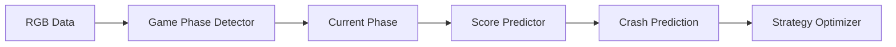

# 🎰 AVIATOR - Multi-Bookmaker Automation System

<div align="center">
  
  **Real-time Game Tracking | ML-Powered Predictions | Automated Betting**
  
  []()
  []()
  []()
  
</div>

---

## 🎯 Project Overview

**AVIATOR** je napredni sistem za **simultano praćenje do 6 online kladionica**, dizajniran za prikupljanje podataka u realnom vremenu, ML analizu i automatizaciju betting strategija na Aviator igri.

### ⚡ Key Highlights

- 🔍 **OCR Speed**: < 15ms sa template matching
- 📊 **Data Throughput**: ~1,000 rounds/hour (6 bookmakers)
- 🎯 **Accuracy**: 99%+ data accuracy rate
- 💾 **Batch Processing**: 50x faster database writes
- 🔄 **Auto-Recovery**: Automatic crash recovery
- 🎮 **GUI Control**: Full-featured control panel

---

## 🚀 Quick Start (5 minutes)

```bash
# 1. Install dependencies
pip install -r requirements.txt

# 2. Install Tesseract OCR
# Windows: https://github.com/UB-Mannheim/tesseract/wiki
# Linux: sudo apt install tesseract-ocr

# 3. Launch Control Panel
python main.py

# 4. Configure & Start
# Click "⚙️ Setup Config" → Add bookmakers → START
```

---

## 📊 Core Functionality

### 1. 📈 Data Collection System
Prikuplja podatke sa više kladionica simultano koristeći napredni OCR sistem.

<table>
<tr>
<td>

**Collected Data**
- Final scores (crash points)
- Player counts
- Money totals
- Threshold crossings
- Loading durations
- Game phases

</td>
<td>

**Performance**
- 160-165 rounds/hour per bookmaker
- Real-time processing
- Batch database writes
- Zero data loss
- Automatic validation

</td>
</tr>
</table>

### 2. 🤖 ML Models & Predictions



**Implemented Models:**
- ✅ Game Phase Detector (RGB → Phase)
- ✅ Bet Button State Classifier
- 🚧 Score Predictor (in development)
- 📅 Strategy Optimizer (planned)

### 3. 💰 Automated Betting

⚠️ **DEMO MODE ONLY** - Koristi demo račune za testiranje!

**Features:**
- Atomic transactions (all-or-nothing)
- Multiple strategies (Martingale, Custom)
- Configurable parameters
- Safety limits
- Auto-recovery

### 4. 🖥️ Control Panel GUI

```
┌────────────────────────────────────────────┐
│  🎰 AVIATOR Control Panel v2.0             │
├────────────────────────────────────────────┤
│ [⚙️ Setup] [💾 Save] [📊 Stats] [🛠️ Tools] │
├────────────────────────────────────────────┤
│ 📊 Data │ 🎨 RGB │ 💰 Agent │ ⏰ Keeper   │
│ ┌──────────────┬──────────────────────┐   │
│ │ STATISTICS   │ LIVE LOGS            │   │
│ │              │                      │   │
│ │ Rounds: 1250 │ [2024-12-20 15:30]  │   │
│ │ Avg: 2.34x   │ Round ended: 3.45x  │   │
│ │ Accuracy: 99%│ Threshold 2x crossed│   │
│ │              │ Batch: 50 records    │   │
│ └──────────────┴──────────────────────┘   │
│ [▶️ START]  [⏸️ PAUSE]  [⏹️ STOP]         │
└────────────────────────────────────────────┘
```

---

## 🏗️ System Architecture

### **KLJUČNI PRINCIP: 1 Bookmaker = 1 Process = 1 CPU Core**

**Zašto paralelizam?** OCR je CPU-intensive (~100ms Tesseract). Sekvencijalno čitanje 6 bookmaker-a bi trajalo 600ms - **neprihvatljivo** za real-time tracking!

```
┌──────────────────────────────────────────────────┐
│            MAIN PROCESS (GUI)                    │
│  - PySide6 Control Panel                         │
│  - ProcessManager (spawns workers)               │
│  - EventBus (receives events)                    │
│  - SharedGameState (optional, GUI monitoring)    │
└─────────┬────────────────────────────────────────┘
          │
          │ Spawns 6 independent worker processes
          │ (TRUE PARALLELISM - 6 CPU cores)
          │
    ┌─────┴──────┬──────────┬──────────┬──────────┐
    │            │          │          │          │
┌───▼─────┐  ┌──▼──────┐ ┌─▼──────┐ ┌─▼──────┐...
│WORKER 1 │  │WORKER 2 │ │WORKER 3│ │WORKER 6│
│Admiral  │  │Mozzart  │ │Balkan  │ │MaxBet  │
└─────────┘  └─────────┘ └────────┘ └────────┘
    │            │          │          │
    ├─ OCR       ├─ OCR     ├─ OCR     ├─ OCR
    ├─ Collectors├─ Coll    ├─ Coll    ├─ Coll
    └─ Agents    └─ Agents  └─ Agents  └─ Agents

All write to:
├─ Database (batch, SQLite WAL mode)
├─ EventBus (real-time GUI updates)
└─ SharedGameState (optional, GUI stats)
```

### Worker Process Internals

**Svaki Worker Process sadrži:**
```python
BookmakerWorkerProcess
├─ OCR Reader (process) - CPU intensive, paralelno!
├─ Local State (dict) - in-process, brzo
├─ Round History (deque 100) - za strategiju
├─ Collectors (process)
│   ├─ MainCollector - prikuplja runde
│   ├─ RGBCollector - ML training data
│   └─ PhaseCollector - phase transitions
├─ StrategyExecutor (object) - odlučuje strategiju
└─ Agents (threads)
    ├─ BettingAgent - izvršava betting
    └─ SessionKeeper - održava sesiju
```

### Key Design Patterns

#### 🔄 Worker Process Parallelism
```python
# ✅ CORRECT - Parallel (NEW architecture)
Worker1: OCR (100ms) ┐
Worker2: OCR (100ms) │ Parallel on
Worker3: OCR (100ms) │ CPU cores
...                  ┘
Total: 100ms (not 600ms!)
```

#### 📦 Batch Operations
```python
# 50x faster than individual inserts
Records → Buffer → Batch Insert (50-100 records)
```

#### 🔒 Atomic Transactions
```python
# All-or-nothing betting operations
Transaction → Lock → Execute → Commit/Rollback → Unlock
```

---

## 📂 Project Structure

```
aviator/
├── 🎮 main.py                 # GUI Entry Point
├── 📋 CLAUDE.md               # AI Instructions
├── 📖 README.md               # This file
├── 📝 CHANGELOG.md            # Version History
├── 🏛️ ARCHITECTURE.md         # Technical Details
│
├── core/                      # Core Systems
│   ├── ocr/                  # OCR Engines
│   ├── capture/              # Screen Capture
│   ├── input/                # Input Control
│   └── communication/        # Event Bus
│
├── collectors/                # Data Collectors
│   ├── main_collector.py     # Primary collector
│   └── rgb_collector.py      # RGB training data
│
├── agents/                    # Automation
│   ├── betting_agent.py      # Betting automation
│   └── session_keeper.py     # Session maintenance
│
├── orchestration/             # Process Control
│   ├── process_manager.py    # Lifecycle management
│   ├── shared_reader.py      # Shared OCR reader
│   └── coordinator.py        # Multi-worker sync
│
└── strategies/                # Betting Strategies
    ├── martingale.py         # Martingale strategy
    └── custom_strategy.py    # Custom strategies
```

---

## 💻 System Requirements

### Minimum Requirements
| Component | Specification |
|-----------|--------------|
| **OS** | Windows 10/11 |
| **Python** | 3.11+ |
| **RAM** | 8GB |
| **CPU** | 4 cores |
| **Storage** | 100GB (for logs) |
| **Network** | Stable connection |

### Recommended Setup
- **CPU**: 8+ cores for 6 bookmakers
- **RAM**: 16GB for smooth operation
- **Storage**: SSD for database
- **Monitor**: 1920x1080 or higher

---

## 📈 Performance Metrics

### With 6 Bookmakers Running

| Metric | Value |
|--------|-------|
| **OCR Speed** | 10-15ms per read |
| **Rounds/Hour** | ~960 total |
| **CPU Usage** | 20-40% |
| **Memory** | ~600MB |
| **Database Growth** | ~100MB/day |
| **Network** | Minimal |

### Data Accuracy

```
├── Score Reading: 99.5%
├── Phase Detection: 98%
├── Threshold Tracking: 99.9%
└── Overall: 99%+
```

---

## 🛠️ Configuration

### Basic Setup
```python
# config/settings.py

# OCR Configuration
OCR_SPEED = "template"  # "template" (10ms) or "tesseract" (100ms)

# Collection Settings
THRESHOLDS = [1.5, 2.0, 2.5, 3.0, 4.0, 5.0, 10.0]
BATCH_SIZE = 50

# Betting (DEMO ONLY)
BASE_BET = 10.0
AUTO_CASHOUT = 2.35
```

### Bookmaker Positions
```json
{
  "bookmakers": [
    {"name": "Bookmaker1", "position": "TL"},
    {"name": "Bookmaker2", "position": "TR"},
    {"name": "Bookmaker3", "position": "ML"},
    {"name": "Bookmaker4", "position": "MR"},
    {"name": "Bookmaker5", "position": "BL"},
    {"name": "Bookmaker6", "position": "BR"}
  ]
}
```

---

## 🚧 Development Roadmap

### ✅ Completed
- [x] Multi-bookmaker support (up to 6)
- [x] GUI control panel
- [x] Shared Reader architecture
- [x] Batch database operations
- [x] Event-driven communication
- [x] Basic betting strategies

### 🔄 In Progress
- [ ] ML score predictor
- [ ] Advanced strategy optimizer
- [ ] Performance optimizations

### 📅 Planned
- [ ] Android remote control app
- [ ] Cloud backup integration
- [ ] Real-time analytics dashboard
- [ ] WebSocket streaming

---

## 📊 Expected Results

### Daily Statistics (6 bookmakers)
```
Total Rounds:     ~5,760
Data Points:      ~28,800
Thresholds:       ~17,280
Database Size:    ~600MB
Success Rate:     99%+
```

### Monthly Projections
```
Total Rounds:     ~172,800
Training Data:    ~864,000 samples
Database Size:    ~18GB
ML Model Accuracy: 95%+ (after training)
```

---

## 🔧 Troubleshooting

### Common Issues

<details>
<summary><b>OCR Not Reading Correctly</b></summary>

1. Check Tesseract installation: `tesseract --version`
2. Verify screen coordinates alignment
3. Ensure browser zoom is 100%
4. Use region visualizer: `python utils/region_visualizer.py`

</details>

<details>
<summary><b>High CPU Usage</b></summary>

1. Switch to template OCR (faster)
2. Increase read intervals
3. Reduce number of bookmakers
4. Check for memory leaks

</details>

<details>
<summary><b>Database Write Errors</b></summary>

1. Check disk space
2. Verify write permissions
3. Increase batch size
4. Check SQLite version

</details>

---

## 🤝 Contributing

We welcome contributions! Please see our [Contributing Guidelines](CONTRIBUTING.md).

### How to Contribute
1. Fork the repository
2. Create feature branch
3. Make changes
4. Run tests
5. Submit pull request

---

## ⚠️ Disclaimer

This software is for **educational and research purposes only**. 

- Use DEMO accounts for testing
- Respect terms of service
- Gamble responsibly
- No warranty provided

---

## 📚 Documentation

| Document | Description |
|----------|-------------|
| [ARCHITECTURE.md](ARCHITECTURE.md) | System design & technical details |
| [CLAUDE.md](CLAUDE.md) | AI development instructions |
| [CHANGELOG.md](CHANGELOG.md) | Version history |
| [Setup Guide](docs/setup.md) | Detailed setup instructions |

---

## 📞 Support

- 📧 Email: support@aviator-project.com
- 💬 Discord: [Join Server](https://discord.gg/aviator)
- 🐛 Issues: [GitHub Issues](https://github.com/aviator/issues)

---

<div align="center">
  
**Built with ❤️ for Data Science & ML Research**

🎰 **Collect Responsibly** | 📊 **Analyze Wisely** | 🤖 **Predict Accurately**

</div>